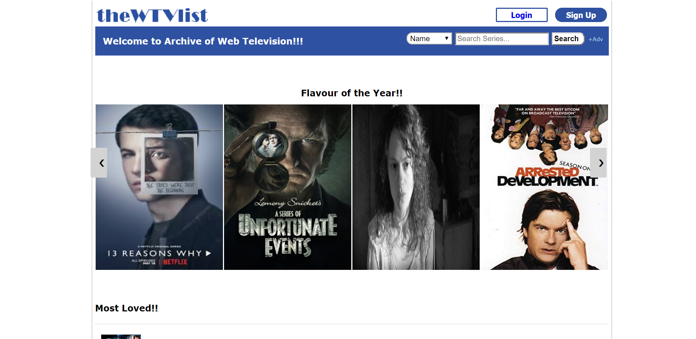
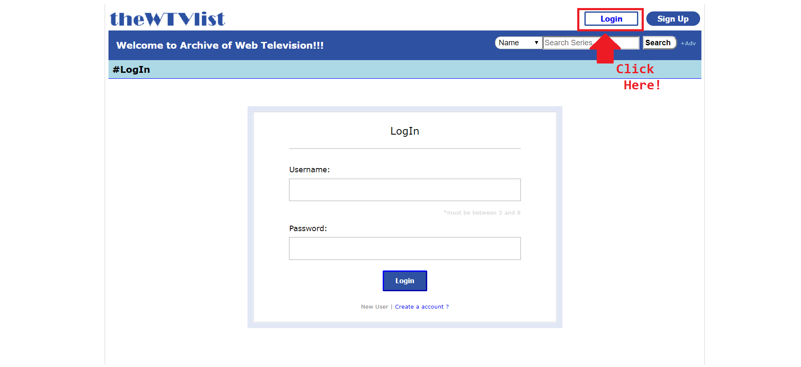
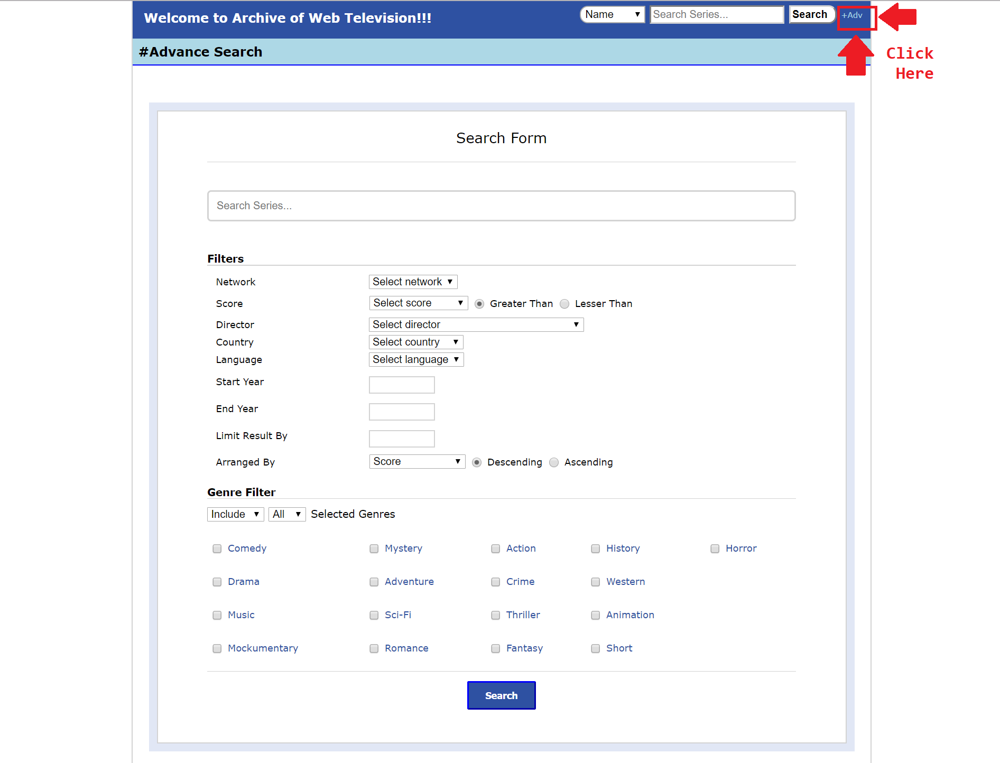
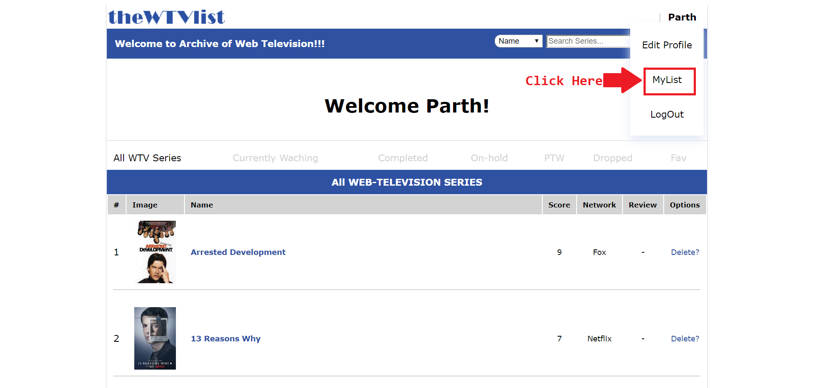

    
     
    The Web-TV-Series List
   

The website is hosted on [infinityfree.net](http://thewtvlist.epizy.com/) (Do check out Adv Search.)

      

## Index

- [Index](#index)
- [About](#about)
  - [Goal](#goal)
  - [Database](#database)
- [Gallery](#gallery)
- [Donations](#Donations)
- [Credit/Acknowledgment](#creditacknowledgment)
- [License](License)
- [Chat](Chat)

## About

This is Entertainment(Web TV Series)-Cataloging website, with advance search options using SQL queries. The project is heavily-inspired by [myanimelist.net](https://myanimelist.net/) , This is database and PHP project rather than a front-end project.

### Goal

The end product is simple, A user can choose a from a good list of Web Series and rate according to xer preferences, and also can mark it as "Currently Watching"/"Completed"/"On-hold"/"Plan To Watch"/"Dropped" and/or as Favorite. A User can have upto 3 favorite series and can give one review per series. Further the user can edit xer review and change the mark accordingly. 

Search Queries can be adjusted to almost every specific detail.

### Database

Below are the tables required for this project.

Legend:

- Sid: Series Id
- Sname: Name of the Series
- ytbCode: youtube code for trailer
- Uid: User Id
- others: self-explainatory

#### slist (List of Web-Series):

| Sid                       | Sname                      | coverImg                   | noOfSeason              | totalNoOfEp               | network                    | ytbCode                    | rating                      | date                       | producer                   | director                   | country                    | lang                       | description                | members                   | favCount                  | users                     |
| ------------------------- | -------------------------- | -------------------------- | ------------------------- | ------------------------- | -------------------------- | -------------------------- | --------------------------- | -------------------------- | -------------------------- | -------------------------- | -------------------------- | -------------------------- | -------------------------- | ------------------------- | ------------------------- | ------------------------- |
| 
INT
 | 
TEXT
 | 
TEXT
 | 
INT
 | 
INT
 | 
TEXT
 | 
TEXT
 | 
FLOAT
 | 
TEXT
 | 
TEXT
 | 
TEXT
 | 
TEXT
 | 
TEXT
 | 
TEXT
 | 
INT
 | 
INT
 | 
INT
 |

#### glist (List of Genre):

| Sid                       | Genre                      |
| ------------------------- | -------------------------- |
| 
INT
 | 
TEXT
 |

#### ulist (List of Users):

| uid                       | email                      | uname                      | pword                      | FavCount                  |
| ------------------------- | -------------------------- | -------------------------- | -------------------------- | ------------------------- |
| 
INT
 | 
TEXT
 | 
TEXT
 | 
TEXT
 | 
INT
 |

#### mylistdb (List of which user is associated with which Series):

| uid                       | Sid                       | score                       | type                      |
| ------------------------- | ------------------------- | --------------------------- | ------------------------- |
| 
INT
 | 
INT
 | 
FLOAT
 | 
INT
 |

#### flist (Favorites list):

| uid                       | sid                       |
| ------------------------- | ------------------------- |
| 
INT
 | 
INT
 |

#### rlist (Review List):

| Sid                       | uid                       | review                     |
| ------------------------- | ------------------------- | -------------------------- |
| 
INT
 | 
INT
 | 
TEXT
 |

## Gallery

- ### Main Page

 
    
 

 

- ### Login Page

 
    
 

 

- ### Advance Search Page

 
    
 

 

- ### Series

 
    
 

 

- ### MyList

 
    
 

 

 

## Donations

 

## Credit/Acknowledgment

 

## License

 

## Chat

  
